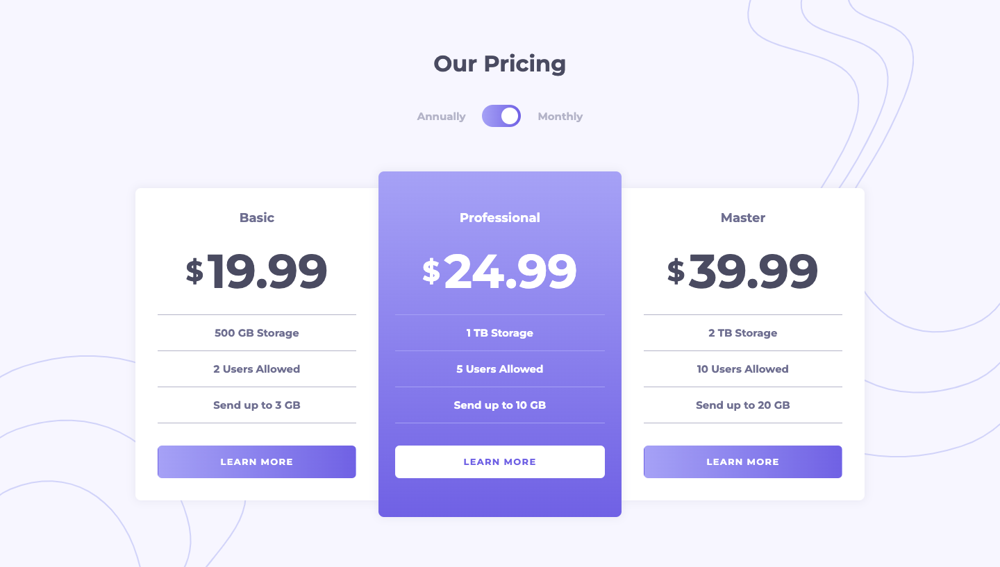

# Frontend Mentor - Pricing component with toggle solution

This is a solution to the [Pricing component with toggle challenge on Frontend Mentor](https://www.frontendmentor.io/challenges/pricing-component-with-toggle-8vPwRMIC). Frontend Mentor challenges help you improve your coding skills by building realistic projects. 

## Table of contents

- [Overview](#overview)
  - [The challenge](#the-challenge)
  - [Screenshot](#screenshot)
  - [Links](#links)
- [My process](#my-process)
  - [Built with](#built-with)
  - [What I learned](#what-i-learned)
  - [Continued development](#continued-development)
- [Author](#author)

## Overview

### The challenge

Users should be able to:

- View the optimal layout for the component depending on their device's screen size
- Control the toggle with both their mouse/trackpad and their keyboard
- **Bonus**: Complete the challenge with just HTML and CSS

### Screenshot

### Links

- Solution URL: [frontendmentor.io](https://www.frontendmentor.io/solutions/toggling-pricing-component-4OSVBGVlw_)
- Live Site URL: [ntjnh-pricing-component.netlify.app](https://ntjnh-pricing-component.netlify.app/)

## My process

### Built with

- [React](https://reactjs.org/)
- [SCSS](https://sass-lang.com/)
- Mobile-first

### What I learned

I learnt how make a toggle, which is something I've never done before so that was a fun little challenge, which turned out not to be very difficult at all.

### Continued development

I'm starting to become really comfortable with some of the more simple parts of React development so looking forward to trying more and more difficult challenges.

## Author

- Website - [Nate](https://natejonah.com)
- Frontend Mentor - [@ntjnh](https://www.frontendmentor.io/profile/ntjnh)
- Twitter - [@natejonah](https://www.twitter.com/natejonah)
